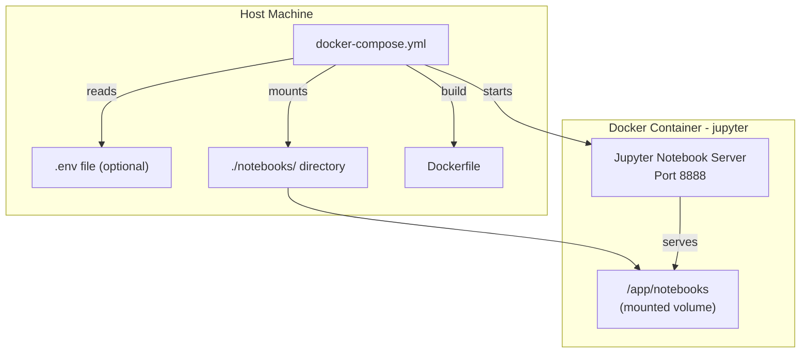

# Design Document

## Overview

Thiết kế này mô tả việc tái cấu trúc repository từ project KKBOX Churn Prediction thành một nền tảng Jupyter Notebook self-host thuần túy sử dụng Docker. Quá trình bao gồm: xóa toàn bộ nội dung KKBOX, tạo Dockerfile generic (không COPY source code), Docker Compose với biến môi trường có thể cấu hình, file .env.example, README hướng dẫn triển khai, .gitignore phù hợp, và thư mục notebooks với notebook mẫu.

**Thiết kế tuân theo nguyên tắc:**
- Không có dữ liệu hay code ứng dụng trong image — mọi thứ qua volume mount
- Cấu hình linh hoạt qua biến môi trường với giá trị mặc định hợp lý
- Đơn giản hóa tối đa: một lệnh `docker compose up --build` là đủ để chạy

## Architecture



**Architecture Decisions:**

1. **No COPY instruction** — Dockerfile chỉ cài đặt runtime dependencies. Tất cả notebook và data được mount qua volume, cho phép thay đổi file mà không cần rebuild image.

2. **Single service compose** — Chỉ cần một service "jupyter". Không cần database hay reverse proxy cho use case self-host đơn giản.

3. **Environment variable substitution with defaults** — Mọi tham số có thể cấu hình đều có giá trị mặc định trong docker-compose.yml, nên `.env` file là optional.

## Components and Interfaces

### 1. File Cleanup Strategy

**Phạm vi xóa:**

| Category | Files/Directories to Remove |
|----------|---------------------------|
| Data files | Entire `data/` directory (CSV, .npy, .pickle, .scala, .ipynb, subdirectories) |
| KKBOX notebooks | All .ipynb and .py in `notebooks/` (Exploration_data_analysis, Preprocessing, Training_model*, 00_Memory_Optimization_Helper, create_monthly_labels.py) |
| KKBOX docs | INDEX.md, PROJECT_SUMMARY.txt, QUICKSTART.md, SUMMARY.md, `notebooks/docs/` |
| OS/IDE artifacts | All `.ipynb_checkpoints/` directories, all `.DS_Store` files |
| Empty directories | Any directories left empty after cleanup |

**Files to retain:** Dockerfile, docker-compose.yml, README.md (will be rewritten), .gitignore (will be rewritten)

### 2. Dockerfile

```dockerfile
# Base image
FROM python:3.10-slim

# Environment settings
ENV PYTHONDONTWRITEBYTECODE=1
ENV PYTHONUNBUFFERED=1

# Working directory
WORKDIR /app/notebooks

# System dependencies for scientific computing
RUN apt-get update && apt-get install -y \
    build-essential \
    gcc \
    g++ \
    libgomp1 \
    && rm -rf /var/lib/apt/lists/*

# Python packages
RUN pip install --no-cache-dir --upgrade pip && \
    pip install --no-cache-dir \
    notebook \
    pandas \
    numpy \
    matplotlib \
    seaborn \
    scikit-learn

# Expose Jupyter port
EXPOSE 8888

# Start Jupyter Notebook
CMD ["jupyter", "notebook", \
     "--ip=0.0.0.0", \
     "--port=8888", \
     "--no-browser", \
     "--allow-root", \
     "--NotebookApp.token=''"]
```

**Design Rationale:**
- `WORKDIR /app/notebooks` — sets the default directory where Jupyter opens, matching the volume mount target
- No `COPY . .` — all project files come through volume mounts at runtime
- `--NotebookApp.token=''` — disables authentication by default (configurable via env var override)
- Libraries limited to core data science stack (pandas, numpy, matplotlib, seaborn, scikit-learn) — users can extend via custom Dockerfile

### 3. Docker Compose

```yaml
services:
  jupyter:
    build:
      context: .
      dockerfile: Dockerfile
    container_name: jupyter-notebook
    ports:
      - "${JUPYTER_PORT:-8888}:8888"
    volumes:
      - ./notebooks:/app/notebooks
    deploy:
      resources:
        limits:
          cpus: "${CPU_LIMIT:-4.0}"
          memory: "${MEMORY_LIMIT:-8G}"
    shm_size: "${SHM_SIZE:-2gb}"
    environment:
      - JUPYTER_ENABLE_LAB=yes
      - PYTHONUNBUFFERED=1
      - JUPYTER_IOPUB_DATA_RATE_LIMIT=10000000000
      - JUPYTER_IOPUB_MSG_RATE_LIMIT=100000
    restart: unless-stopped
```

**Design Rationale:**
- Service named "jupyter" (generic, not project-specific)
- `restart: unless-stopped` — ensures notebook persists through host reboots
- Removed `version: "3.9"` — deprecated in modern Docker Compose
- Volume mount `./notebooks:/app/notebooks` — single directory for all user notebooks
- All resource limits use `${VAR:-default}` syntax for optional .env overrides

### 4. Environment Configuration (.env.example)

```env
# Jupyter Notebook Self-Host Configuration
# Copy this file to .env and modify values as needed.
# All values have sensible defaults — .env file is optional.

# Port for Jupyter Notebook web interface
# Valid: integer 1024–65535
JUPYTER_PORT=8888

# CPU core limit for the container
# Valid: decimal number 0.5–16.0
CPU_LIMIT=4.0

# Memory limit for the container
# Valid: integer followed by G or M (e.g., 8G, 4096M)
MEMORY_LIMIT=8G

# Shared memory size (prevents kernel crashes with large datasets)
# Valid: integer followed by g or m (e.g., 2gb, 512mb)
SHM_SIZE=2gb

# Jupyter authentication token
# Valid: alphanumeric string, or empty for no authentication
# WARNING: Empty token means no password protection — use only in trusted networks
JUPYTER_TOKEN=
```

### 5. README.md Structure

The README will contain these sections in order:

1. **Title & description** — "Jupyter Notebook Self-Host" with one-line description
2. **Prerequisites** — Docker ≥ 20.10, Docker Compose ≥ 2.0
3. **Quick Start** — `docker compose up --build` with expected output
4. **Configuration** — Table of all env vars from .env.example
5. **Accessing Jupyter** — URL (http://localhost:8888), token info
6. **Data Persistence** — Volume mount explanation, restart behavior
7. **Stopping & Cleanup** — `docker compose down`, `docker compose down -v`
8. **Customization** — Adding Python packages, extending Dockerfile

### 6. .gitignore

```gitignore
# Jupyter
.ipynb_checkpoints/

# Python
__pycache__/
*.py[cod]
*$py.class
env/
venv/

# Environment
.env

# Data files
*.csv
*.npy
*.pickle
*.h5
*.zip
*.gz

# OS
.DS_Store
Thumbs.db
```

**Design Rationale:**
- Excludes `.env` but NOT `.env.example` (no explicit pattern for .env.example needed since `.env` pattern only matches exactly `.env`)
- Data file extensions excluded to prevent accidental commits of large datasets
- No `data/` directory pattern — the directory won't exist anymore, and data files are covered by extension patterns

### 7. Sample Notebook (notebooks/hello.ipynb)

A minimal Jupyter notebook in JSON format containing:
- One markdown cell: "# Hello, Jupyter!" with setup verification description
- One code cell: `print("Hello, Jupyter!")` 

Plus a `.gitkeep` file in the notebooks directory to ensure it's tracked even if empty.

## Data Models

This project doesn't have application-level data models. The relevant "data" structures are:

### Docker Compose Environment Variables

| Variable | Type | Default | Description |
|----------|------|---------|-------------|
| JUPYTER_PORT | integer (1024-65535) | 8888 | Host port mapping |
| CPU_LIMIT | decimal (0.5-16.0) | 4.0 | Container CPU limit |
| MEMORY_LIMIT | string (e.g., 8G) | 8G | Container memory limit |
| SHM_SIZE | string (e.g., 2gb) | 2gb | Shared memory size |
| JUPYTER_TOKEN | string | (empty) | Authentication token |

### File Structure (Post-Cleanup)

```
.
├── .env.example          # Environment variable template
├── .gitignore            # Updated for Jupyter project
├── Dockerfile            # Generic Jupyter image
├── docker-compose.yml    # Single-command deployment
├── README.md             # Deployment guide
└── notebooks/
    ├── .gitkeep          # Preserve directory in git
    └── hello.ipynb       # Sample verification notebook
```

## Error Handling

| Scenario | Handling Strategy |
|----------|------------------|
| `.env` file missing | Docker Compose uses `${VAR:-default}` syntax — all defaults are functional |
| Port 8888 already in use | User sets `JUPYTER_PORT` to alternative port in `.env` |
| Insufficient memory | User increases `MEMORY_LIMIT` in `.env`; Jupyter kernel will crash gracefully with OOM message |
| Volume mount directory missing | Docker Compose creates `./notebooks/` automatically on `docker compose up` |
| Invalid env var values | Docker/Docker Compose will error on startup with descriptive message |
| Container crash | `restart: unless-stopped` policy auto-restarts the container |
| Large dataset operations crash kernel | `shm_size` configured to 2gb default; user can increase via `SHM_SIZE` env var |

## Testing Strategy

Since this feature is entirely infrastructure configuration (Dockerfile, Docker Compose, file cleanup, documentation), property-based testing is NOT applicable. There are no pure functions with varying inputs to test — the deliverables are static configuration files and documentation.

**Testing approach:**

### Manual Verification Checklist

1. **File cleanup verification** — Confirm no KKBOX files remain after cleanup
2. **Docker build** — `docker compose build` completes without errors
3. **Container startup** — `docker compose up` starts Jupyter successfully
4. **Port accessibility** — http://localhost:8888 loads Jupyter interface
5. **Volume mount** — Files created in Jupyter UI appear in `./notebooks/` on host
6. **Sample notebook** — `hello.ipynb` opens and runs `print("Hello, Jupyter!")` correctly
7. **Environment override** — Setting `JUPYTER_PORT=9999` in `.env` maps to correct port
8. **Container restart** — `docker compose down && docker compose up` preserves notebooks
9. **Resource limits** — `docker stats` shows configured CPU/memory limits

### Smoke Tests (Shell Script)

A verification script can be created to automate:
- `docker compose build` exits 0
- `docker compose up -d` exits 0
- `curl -s http://localhost:8888` returns HTTP 200 within 30 seconds
- `docker compose down` exits 0

### Documentation Review

- README follows all steps end-to-end on a fresh machine
- .env.example values are valid and match docker-compose.yml defaults
- All referenced file paths exist in the repository

**Why PBT does not apply:**
This feature consists of declarative configuration files (Dockerfile, docker-compose.yml), environment variable templates, documentation, and file deletion operations. There are no functions with input/output behavior that vary meaningfully with different inputs. The correct testing strategy is smoke tests (single execution verification) and manual checklists.
